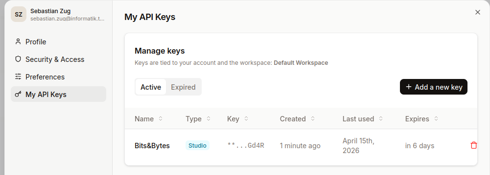

<!--
author:   Sebastian Zug

email:    sebastian.zug@informatik.tu-freiberg.de

version:  0.1.0

language: de

narrator: Deutsch Female

icon:     https://media.aubi-plus.com/institution/thumbnail/3f3de48-technische-universitaet-bergakademie-freiberg-logo.jpg

import:   https://raw.githubusercontent.com/LiaScript/CodeRunner/master/README.md

-->

[](https://liascript.github.io/course/?https://raw.githubusercontent.com/SebastianZug/RoboLabVortraege/refs/heads/main/123_MistralAPI/presentation.md#1)

# TUBAF Bits&Bytes

Anfragen an KI-Chatbots automatisieren – Mistral AI in Python einbinden
----------------------------------------------------------------

Donnerstag, 16.04.2026, 17 Uhr, RoboLab der TU Bergakademie Freiberg

---------------------

Prof. Dr. Sebastian Zug (Fakultät 1)

> _Moderne KI-Sprachmodelle lassen sich über offene APIs direkt in Python-Skripte einbinden – ohne Umweg über eine grafische Oberfläche. Das eröffnet ganz neue Möglichkeiten: von der automatisierten Auswertung großer Textmengen über die Bildanalyse bis hin zur Evaluation wissenschaftlicher Daten im Rahmen von Forschungs- und Lehrprojekten._
>
> _Im dieswöchigen Bits&Bytes-Vortrag zeigen wir, wie man mit wenigen Zeilen Python die Mistral-API anspricht, Anfragen strukturiert und die Antworten weiterverarbeitet. Vorkenntnisse in Python sind hilfreich, aber kein Muss._

## 1. Motivation

> Wofür nutzen Sie welche KI-Tools in Ihrem Alltag? Welche Anwendungsfälle könnten von einer API-Integration profitieren?

__Warum eine API statt Web-Oberfläche?__

+ __Automatisierung__ – Hunderte Abstracts, Protokolle, Klausuren in einem Rutsch auswerten.
+ __Reproduzierbarkeit__ – Parameter (Modell, Temperatur, System-Prompt) sind Code, nicht Klickpfade.
+ __Integration__ – Daten-Pipelines, Jupyter, eigenen Datenbanken, CI.
+ __Strukturierte Ausgaben__ – JSON statt Fließtext, direkt weiterverarbeitbar.

__Warum Mistral?__

+ Europäischer Anbieter (Paris), Server in der EU – relevant für Datenschutz-sensitive Forschungsdaten.
+ Offene Gewichte für einen Teil der Modelle (`mistral-small`, `pixtral`), lokal betreibbar.
+ Kompetitive Qualität bei vergleichsweise niedrigen Preisen.
+ Saubere, OpenAI-kompatible REST-API.

https://console.mistral.ai/home


## 2. Der API-Zugang

__Account und Key__

1. Registrierung unter [console.mistral.ai](https://console.mistral.ai).
2. Zahlungsmittel hinterlegen (Mistral bietet auch ein kostenfreies Experimentier-Tier).
3. Unter _API Keys_ einen neuen Schlüssel erzeugen — wird **einmalig** angezeigt.



### Einfacher HTTP-POST Zugriff

Eine API-Anfrage ist nichts anderes als ein HTTP-POST mit JSON-Body. Bevor wir SDKs benutzen, schauen wir uns das nackte Protokoll an:

```python Https_Request.py
import urllib.request, json

# Demo-Key, wird nach dem Vortrag gelöscht.
API_KEY = "GzgXI7iFc9ZhGYwPuy8z7rSjkHZUGd4R"

# messages ist der gesamte Dialogverlauf.
payload = {
    "model": "mistral-small-latest",
    "messages": [
        {"role": "user",
         "content": "Nenne drei Fakten zur TU Bergakademie Freiberg."}
    ],
}

req = urllib.request.Request(
    "https://api.mistral.ai/v1/chat/completions",
    data=json.dumps(payload).encode("utf-8"),
    headers={
        "Authorization": f"Bearer {API_KEY}",
        "Content-Type": "application/json",
    },
    method="POST",
)

with urllib.request.urlopen(req, timeout=30) as r:
    response = json.loads(r.read())

# Antwort-Pfad: choices[0].message.content
print(response["choices"][0]["message"]["content"])
```
@LIA.eval(`["main.py"]`, `none`, `python3 main.py`)

__Completion ist nicht alles – weitere Endpoints der Mistral-API__

Alle unter `https://api.mistral.ai/v1/`:

| Endpoint                | Zweck                                                                             |
| :---------------------- | :-------------------------------------------------------------------------------- |
| `/chat/completions`     | Unser Standard – strukturierter Dialog, Text oder multimodal (Pixtral).           |
| `/fim/completions`      | __Fill-in-the-Middle__ – Code-Vervollständigung mit Präfix + Suffix (Codestral).  |
| `/embeddings`           | Text → Vektor. Grundlage für semantische Suche, RAG, Clustering.                  |
| `/moderations`          | Inhaltsklassifikation (Hass, Gewalt, etc.) für Filter-Pipelines.                  |
| `/ocr`                  | Strukturierte Text-Extraktion aus PDFs/Bildern (Mistral OCR).                     |
| `/agents/completions`   | Agent-Endpoint mit Tool-Use, Function-Calling, Persistenz.                        |
| `/files`, `/batch`      | Datei-Upload + asynchrone Massenverarbeitung (~50% günstiger).                    |
| `/models`               | GET-Liste aller verfügbaren Modelle.                                              |
| `/fine_tuning/jobs`     | Eigene Fine-Tuning-Jobs starten und verwalten.                                    |


> [API-Referenz (OpenAPI)](https://docs.mistral.ai/api/) – verbindliche Spezifikation aller Endpoints, Parameter, Fehlercodes. Unser Aufruf lebt dort unter _Chat › Create Chat Completions_ (`POST /v1/chat/completions`).

> Die Mistral-API ist weitgehend __OpenAI-kompatibel__ aufgebaut – dieselbe Payload-Struktur funktioniert mit minimalen Anpassungen auch bei OpenAI, Groq, Together u.a.

### Chat-Completion – die Grundstruktur

__Rollen im Nachrichtenverlauf__

| Rolle       | Zweck                                                                  |
| :---------- | :--------------------------------------------------------------------- |
| `system`    | Rahmensetzung, Persona, Regeln – wird einmal am Anfang mitgegeben.     |
| `user`      | Die eigentliche Frage/Instruktion der Nutzer:in.                       |
| `assistant` | Vorangegangene Modellantworten – für Mehrfach-Runden-Dialoge nötig.    |

```python Different_roles.py
import urllib.request, json

API_KEY = "GzgXI7iFc9ZhGYwPuy8z7rSjkHZUGd4R"  # Demo-Key, nach Vortrag gelöscht

payload = {
    "model": "mistral-small-latest",
    "temperature": 0.2,
    "messages": [
        {"role": "system", "content":
            "Du bist ein sachlicher Fachgutachter. Antworte in maximal drei Sätzen."},
        {"role": "user", "content":
            "Erkläre kurz, warum autonome Lieferroboter keine kleinen autonomen Autos sind."},
    ],
}

req = urllib.request.Request(
    "https://api.mistral.ai/v1/chat/completions",
    data=json.dumps(payload).encode("utf-8"),
    headers={"Authorization": f"Bearer {API_KEY}",
             "Content-Type": "application/json"},
    method="POST",
)

with urllib.request.urlopen(req, timeout=30) as r:
    resp = json.loads(r.read())

print(resp["choices"][0]["message"]["content"])
print("---")
print("Tokens:", resp["usage"])
```
@LIA.eval(`["main.py"]`, `none`, `python3 main.py`)

__Wichtige Parameter__

+ `temperature` (0.0 – 1.5) – 0 = deterministisch/faktisch, hoch = kreativer/variabler.
+ `max_tokens` – harte Obergrenze für die Antwortlänge (Kostendeckel!).

__Modellfamilie__ (Stand 2026)

| Modell                   | Stärke                              | Typischer Anwendungsfall         |
| :----------------------- | :---------------------------------- | :------------------------------- |
| `mistral-small-latest`   | günstig, schnell                    | Klassifikation, Extraktion       |
| `mistral-medium-latest`  | ausgewogen                          | Gutachten, Zusammenfassungen     |
| `mistral-large-latest`   | stärkstes Textmodell                | komplexe Analysen, Reasoning     |
| `pixtral-large-latest`   | multimodal (Text + Bild)            | Bildbeschreibung, OCR-ähnlich    |
| `codestral-latest`       | spezialisiert auf Code              | Code-Review, Generierung         |

> https://ollama.com/library/mistral erlaubt den lokalen Betrieb von `mistral-small` und `pixtral` – ideal für datenschutzsensible Projekte oder die Entwicklung von Prototypen ohne API-Calls. Sofern nicht sehr große Cluster bereitstehen, sind die Modelle aber deutlich kleiner als die Cloud-Varianten (7B vs 24 oder 123B Parameter) und damit auch leistungsschwächer.

### Strukturierte Antworten

__Problem__ – Fließtext ist für die Weiterverarbeitung unhandlich. Modelle können aber angewiesen werden, **gültiges JSON** zurückzugeben.

> JSON ist das gebräuchlichste Format für strukturierte Daten – es ist leicht zu parsen, in Python z.B. mit `json.loads()`. Es beschreibt Daten als Schlüssel-Wert-Paare, Listen, verschachtelte Strukturen. 

```json
student = {
    "name": "Anna Müller",
    "age": 22,
    "courses": ["Informatik", "Mathematik"],
    "graduated": false
}
```

```python  JSON_Response.py
import urllib.request, json

API_KEY = "GzgXI7iFc9ZhGYwPuy8z7rSjkHZUGd4R"  # Demo-Key, nach Vortrag gelöscht

text = "Die Vorlesung findet am 15.04.2026 um 17:00 Uhr im Raum MIB-1108 statt."

payload = {
    "model": "mistral-small-latest",
    "temperature": 0.0,
    "response_format": {"type": "json_object"},
    "messages": [
        {"role": "system", "content":
            "Extrahiere Datum, Uhrzeit und Raum. Antworte ausschließlich als JSON "
            "mit den Schlüsseln 'date' (ISO-8601), 'time' (HH:MM), 'room'."},
        {"role": "user", "content": text},
    ],
}

req = urllib.request.Request(
    "https://api.mistral.ai/v1/chat/completions",
    data=json.dumps(payload).encode("utf-8"),
    headers={"Authorization": f"Bearer {API_KEY}",
             "Content-Type": "application/json"},
    method="POST",
)

with urllib.request.urlopen(req, timeout=30) as r:
    resp = json.loads(r.read())

structured = json.loads(resp["choices"][0]["message"]["content"])
print(type(structured), structured)
print("Raum:", structured["room"])
```
@LIA.eval(`["main.py"]`, `none`, `python3 main.py`)

Der entscheidende Schalter: `"response_format": {"type": "json_object"}`. Kombiniert mit einem klaren Schema im System-Prompt erhalten wir **programmatisch verwertbare** Ausgaben.

## 3. MistralPython SDK – der nächste Schritt

Das offizielle SDK kapselt Auth, HTTP und JSON-Handling. Derselbe Aufruf wie im rohen Beispiel, deutlich kürzer:

```python SDK_Request.py
# from mistralai import Mistral   # Alte Import Variante, wird nicht mehr unterstützt
from mistralai.client import Mistral

API_KEY = "GzgXI7iFc9ZhGYwPuy8z7rSjkHZUGd4R"

client = Mistral(api_key=API_KEY)

resp = client.chat.complete(
    model="mistral-small-latest",
    messages=[
        {"role": "user",
         "content": "Nenne drei historische Forscherpersönlichkeiten, die an der TU Bergakademie Freiberg gearbeitet haben."}
    ],
)

print(resp.choices[0].message.content)
```
@LIA.eval(`["main.py"]`, `pip install -q mistralai`, `python3 main.py`)

Was der SDK abnimmt:

+ kein manuelles `json.dumps` / `urlopen` / Header-Setzen,
+ typisierte Rückgabeobjekte (`resp.choices[0].message.content` statt Dict-Indizes),
+ Retries, Timeouts, Streaming, Async – alles über Methoden am `client`.

> **Aber:** Womit erkaufen wir diesen Komfort? ... Abhängigkeiten! Man sieht es sehr schön am Import: `from mistralai.client import Mistral` statt `import mistralai`. Das SDK ist ein zusätzliches Paket, das installiert und gepflegt werden muss. In einem echten Projekt wollen wir das sauber managen – siehe nächstes Kapitel.

## 4. Vom Skript zur Struktur

Ab hier verlassen wir den Live-Editor und wechseln in ein lokales Python-Projekt. Wiederkehrende Setup-Details gehören nicht in jede Zelle, Keys nicht in den Code, und die Abhängigkeiten sollen auf Windows, macOS und Linux gleich reproduzierbar sein.

Das gesamte Beispiel liegt unter [codebeispiele/ChatCompletion/](codebeispiele/ChatCompletion/) im Repo.

__Projektstruktur__

```text
codebeispiele/ChatCompletion/
├── .env.example       # Vorlage für den API-Key (eingecheckt)
├── .env               # echter Key (NICHT eingecheckt)
├── .gitignore         # hält .env und .venv aus dem Repo
├── .python-version    # festgelegte Python-Version für uv
├── pyproject.toml     # Abhängigkeiten + Projekt-Metadaten
├── uv.lock            # exakte Versionen (von uv erzeugt)
├── README.md          # Setup- und Ausführungsanleitung
└── chat.py            # das eigentliche Skript
```

### Geheimniskrämerei

Ein API-Key hat im Quellcode nichts verloren – er wandert sonst ins Git-Log und bleibt dort für immer. Üblich ist eine Datei `.env` im Projektverzeichnis:

```text
# .env
MISTRAL_API_KEY=sk-xxxxxxxxxxxxxxxxxxxxxxxx
```

Die Bibliothek `python-dotenv` liest sie zur Laufzeit in die Umgebungsvariablen ein, sodass das Skript sie über `os.environ` abruft. Entwickler bekommen über die eingecheckte `.env.example` eine Vorlage – jede:r trägt den eigenen Key in die private `.env` ein.

### Das bleibt aber unter uns

```text
# .gitignore
.venv/
.env
__pycache__/
*.pyc
```

Damit ist ausgeschlossen, dass Key und Virtualenv versehentlich im Repo landen. Der Unterschied zu `.env.example`: letztere ist bewusst eingecheckt, enthält aber nur Platzhalter.

### Abhängigkeiten explizit machen

Unser Nutzer weiß nicht, dass er `mistralai` und `python-dotenv` braucht, um unseren Code ausführen zu können. Möglicherweise sogar eine bestimmte Version ...

... wir sollten es im einfach machen und die Abhängigkeiten beschreiben, damit sie automatisch installiert werden können.

```toml
[project]
name = "chat-completion"
version = "0.1.0"
description = "Minimalbeispiel: Mistral Chat-Completion via SDK"
requires-python = ">=3.11"
dependencies = [
    "mistralai>=2.0.0",
    "python-dotenv>=1.0.0",
]
```

`uv sync` liest die Datei, installiert die Pakete in ein lokales `.venv/` und schreibt in `uv.lock` die tatsächlich aufgelösten Versionen fest – das ergibt auf jedem Rechner dasselbe Ergebnis.

https://docs.astral.sh/uv/

### Das Skript

```python chat.py
import os
from dotenv import load_dotenv
from mistralai.client import Mistral

load_dotenv()

client = Mistral(api_key=os.environ["MISTRAL_API_KEY"])

resp = client.chat.complete(
    model="mistral-small-latest",
    messages=[
        {"role": "user",
         "content": "Nenne drei Fakten zur TU Bergakademie Freiberg."}
    ],
)

print(resp.choices[0].message.content)
```


> Was fehlt? Fehlerbehandlung, Logging, Modularisierung – das hier ist ein __Minimalbeispiel__, um die API-Integration zu zeigen. In einem echten Projekt würden wir Funktionen, Klassen, vielleicht sogar eine eigene `Client`-Wrapper-Klasse für wiederkehrende Anfragen anlegen.

### Die Bedienungsanleitung

Ein Mini-Projekt wird erst dann reproduzierbar, wenn die `README.md` sagt, wie man es auf dem eigenen Rechner zum Laufen bringt. Drei Befehle reichen:

```bash
uv sync                            # Abhängigkeiten installieren
cp .env.example .env               # Key-Vorlage kopieren (dann Key eintragen)
uv run chat.py                     # ausführen
```

Diese drei Zeilen laufen identisch unter Windows (PowerShell), macOS und Linux – genau das ist der Gewinn gegenüber einer `venv`/`activate`-Anleitung mit OS-spezifischen Varianten.

## 6. Praxisfälle

> Welche Anwendungsfälle hätten Sie in Ihrem Forschungsfeld? In welcher Form liegen die Daten vor?

### Texterschließung und -klassifikation

__Szenario__ – Aus einer Sammlung von Abstracts von Studienarbeiten sollen pro Dokument _Forschungsgebiet_, _Methode_ und _genutzte Programmiersprachen_ extrahiert und tabellarisch zusammengeführt werden.

Das vollständige Beispiel liegt unter [codebeispiele/AbstractClassifier/](codebeispiele/AbstractClassifier/) und enthält fünf thematisch unterschiedliche Beispiel-Abstracts (Robotik, Bildklassifikation, Hardware-Instrumentierung, juristische Arbeit ohne Code, semantische Suche). Aufbau analog zum vorigen Beispiel — `pyproject.toml`, `.env`, `.gitignore`, `README.md`, dazu:

| Datei            | Zweck                                                                  |
| :--------------- | :--------------------------------------------------------------------- |
| `abstracts.csv`  | Input – fünf Zeilen mit Abstract-Texten.                               |
| `classify.py`    | Pipeline: CSV → Mistral → Pydantic-Validierung → DataFrame → Parquet.  |

__Drei Bausteine im Skript__

1. __Pydantic-Schema__ `AbstractInfo` – beschreibt die erwartete Antwortstruktur und validiert sie. Ein zusätzlicher `field_validator` fängt den Fall ab, dass das Modell trotz Anweisung doch eine Liste statt eines Strings liefert.
2. __System-Prompt__ – fordert explizit ein JSON-Objekt mit drei Feldern, mit klaren Längenvorgaben pro Feld. Das ist der entscheidende Hebel für stabile Ausgaben.
3. __pandas-Schleife__ – `df["text"].apply(classify)` durchläuft die Spalte und hängt die extrahierten Felder als neue Spalten an. Speicherung als Parquet für die spätere Analyse in Jupyter.

```bash
cd codebeispiele/AbstractClassifier
uv sync
cp .env.example .env   # Key eintragen
uv run classify.py
```

__Praktische Hinweise__ für die Skalierung auf hunderte Dokumente

+ __Rate Limits__ – pro Modell und Account-Tier begrenzt; bei Massenverarbeitung `time.sleep` oder `tenacity`-Retry mit exponential backoff.
+ __Batch-API__ – Mistral bietet eine Batch-Endpoint-Variante (asynchron, ~50 % günstiger) für Jobs, die nicht live beantwortet werden müssen.
+ __Caching__ – identische Prompts zwischenspeichern (z. B. `diskcache`), spart Geld bei Prompt-Iterationen.
+ __Timeout erhöhen__ – Default sind ~30 s; bei längeren Antworten hilft `Mistral(api_key=..., timeout_ms=120_000)`.

### Bildanalyse mit Pixtral

__Szenario__ – Aus einem lokalen Bild (handschriftliche Notiz, Plot, Diagramm, Screenshot) soll automatisch eine Beschreibung bzw. eine strukturierte Repräsentation erzeugt werden.

Das vollständige Beispiel liegt unter [codebeispiele/PixtralVision/](codebeispiele/PixtralVision/) und nutzt Mistrals multimodales Modell `pixtral-large-latest`. Aufbau wie in den vorigen Projekten — `pyproject.toml`, `.env`, `.gitignore`, `README.md`, dazu:

| Datei                           | Zweck                                                                              |
| :------------------------------ | :--------------------------------------------------------------------------------- |
| `describe.py`                   | CLI-Skript: Bildpfad und optionaler Prompt als Argumente, Beschreibung auf stdout. |
| `images/OCR.png`                | Handschriftliche mathematische Formel.                                             |
| `images/eisen_kohlenstoff.png`  | Eisen-Kohlenstoff-Phasendiagramm (Wikimedia Commons, CC BY-SA 4.0).                |

__Was im Vergleich zum Text-Aufruf neu ist__

Statt eines einfachen Strings ist `content` jetzt eine __Liste von Content-Parts__:

+ ein Part `{"type": "text", "text": ...}` mit dem Prompt,
+ ein Part `{"type": "image_url", "image_url": "data:image/...;base64,..."}` mit dem Bild.

Pixtral akzeptiert Bilder als Base64-`data:`-URI (lokale Dateien) oder als reguläre `https://`-URL. Antwortstruktur und Aufrufmuster sind ansonsten identisch zur reinen Text-Completion. Das Skript skaliert Bilder via Pillow auf max. 1024 px Längskante — das spart Bild-Tokens und entspannt Rate-Limits merklich.

```bash
cd codebeispiele/PixtralVision
uv sync
cp .env.example .env   # Key eintragen
```

__Beispiel 1: handschriftliche Formel → LaTeX__

```bash
uv run describe.py images/OCR.png \
  "Auf dem Bild ist eine handschriftliche mathematische Formel zu sehen. \
   Gib sie als LaTeX-Code aus, eingeschlossen in \$\$ ... \$\$. \
   Antworte ausschließlich mit dem LaTeX-Code, ohne erklärenden Text."
```

Antwort:

```latex
$$y = 2x^2 - 4x + 5$$
```

__Beispiel 2: Diagramm interpretieren – und wo Pixtral scheitert__

Die zweite Demo nimmt ein Eisen-Kohlenstoff-Phasendiagramm ([Wikimedia Commons, CC BY-SA 4.0](https://commons.wikimedia.org/wiki/File:Eisen_Kohlenstoff_Diagramm_Deutsch.svg)):

```bash
uv run describe.py images/eisen_kohlenstoff.png \
  "Welche Aussage trifft das Diagramm? Beschreibe sachlich, was abgebildet ist, \
   welche Achsen verwendet werden und welche Phasen oder Bereiche markiert sind."
```

Pixtral liefert eine selbstbewusste, sachlich **falsche** Antwort – und das ist die didaktisch wertvollste Folie des Vortrags:

| Pixtral behauptet                                         | Tatsächlich im Diagramm                                 |
| :-------------------------------------------------------- | :------------------------------------------------------ |
| Y-Achse = Druck                                           | Y-Achse = Temperatur                                    |
| X-Achse = Temperatur                                      | X-Achse = Kohlenstoffanteil in %                        |
| Phasen fest / flüssig / gasförmig (wie reine Substanz)    | Austenit, Ferrit, Zementit, Perlit, Ledeburit …         |
| Schmelzpunkt 798 °C, Siedepunkt 1165 °C                   | Zahlen frei erfunden                                    |

Das Modell generalisiert vom Muster „Phasendiagramm" auf das in Trainingsdaten häufigere T/p-Diagramm reiner Substanzen und erfindet konkrete Zahlen auf drei Stellen genau. Merksatz für den Vortrag: __ein LLM merkt nicht, wenn es daneben liegt — in fachlich spezialisierten Domänen ist Validierung Pflicht.__

__Einsatzfelder im Lehr-/Forschungsalltag__

+ Handschriftliche Notizen und Formeln in Markup (LaTeX, Markdown) überführen.
+ Automatische Beschreibung von Diagrammen/Plots für Barrierefreiheit (Alt-Texte).
+ Screenshot-OCR für Altunterlagen.
+ Plausibilitätschecks bei Abbildungen – mit der Einschränkung, dass fachspezifische Darstellungen (Phasendiagramme, Schaltpläne, Normzeichnungen) besondere Sorgfalt bei der Validierung erfordern.

## 8. Was kann schiefgehen?

__Das Modell lügt (höflich)__

+ LLMs erfinden Fakten, ohne rot zu werden – gerade bei Detailfragen. Also: Ausgaben immer prüfen, nie blind übernehmen.
+ Das Kontextfenster ist endlich (mistral-small: 128k Tokens). Lange Dokumente vorher in Häppchen teilen.
+ Gleicher Prompt, gleiches Modell, `temperature=0` – trotzdem können Antworten leicht variieren.

__Das Budget schmilzt__

+ Bezahlt wird pro Token, bzw. in Pixtral zusätzlich pro Bild-Token - https://mistral.ai/pricing#api
+ Stellschrauben: `max_tokens` begrenzen, Prompts kurz halten, kleinstes passendes Modell wählen.
+ Budget-Alerts in der Mistral-Console einrichten – bevor die Rechnung überrascht.

__Die Verantwortung bleibt bei Ihnen__

+ Personenbezogene oder prüfungsrelevante Daten gehören nicht in API-Calls ohne klare Rechtsgrundlage.
+ API-Keys regelmäßig rotieren und niemals ins Repo committen (`gitleaks` oder `detect-secrets` als Pre-Commit-Hook).
+ Modell-Version, Parameter und Datum festhalten – sonst lässt sich nichts reproduzieren.

__Auch KI-Projekte brauchen Software-Engineering__
+ Strukturierte Projektablage, Dokumentation, Fehlerbehandlung, Tests – das alles gilt auch für KI-Integrationen!

## Zusammenfassung

+ Eine Mistral-API-Anfrage ist ein HTTP-POST mit Bearer-Token und JSON-Body – nicht mehr.
+ `response_format: json_object` + Pydantic macht Antworten direkt weiterverarbeitbar.
+ Für Produktivcode: SDK, `.env`, strukturierte Projektablage.
+ Pixtral öffnet die Tür zu multimodalen Pipelines.
+ Kosten, Reproduzierbarkeit und Datenschutz sind Teil des Engineerings.

__Material & Code__

+ [Offizielle API-Referenz](https://docs.mistral.ai/)
+ [Mistral Python SDK](https://github.com/mistralai/client-python)
+ Die Beispielskripte dieses Vortrags liegen unter `123_MistralAPI/project/` im Repository.
