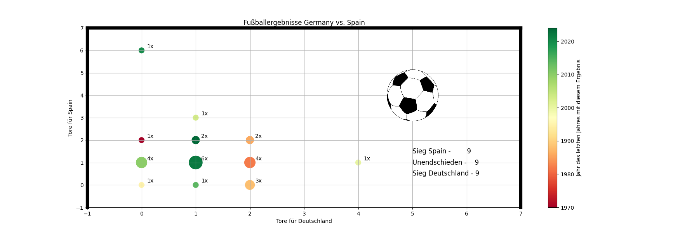
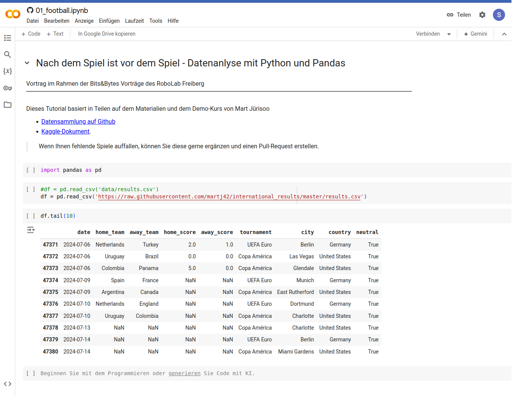

# Nach dem Spiel ist vor dem Spiel

<h2>Datenanlyse mit Python und Pandas </h2>

Vortrag im Rahmen der Bits&Bytes Vorträge des RoboLab Freiberg 

Juli 2024

Prof. Dr. Sebastian Zug

-------------------------------------

<!-- style="width: 100%;" -->

Dieses Tutorial basiert auf dem Materialien von Mart Jürisoo [Datensammlung auf Github](https://github.com/martj42/international_results). Vielen Dank für seine Arbeit und die Veröffentlichung des Datensatzes.

## Agenda 

"Forschungsfragen": 

1. Wie viele Spiele zwischen Spanien und Deutschland sind im Datensatz enthalten?
2. Wie viele Spiele hat Deutschland davon gewonnen, verloren oder mit einem Unendschieden beendet?
3. Was war der höchste Sieg gegen Spanien?

   ...

10. Können wir all diese Informationen in einer Grafik zusammenführen

    ...

100. Wer wird Europameister 2024 :-)?

## Vorgehen

Der [Datensatz](https://github.com/martj42/international_results) ist in einer CSV-Datei gespeichert und umfasst aktuell (11.Juli 2024) 47.378 Einträge. 

```csv
date,home_team,away_team,home_score,away_score,tournament,city,country,neutral
1872-11-30,Scotland,England,0,0,Friendly,Glasgow,Scotland,FALSE
1873-03-08,England,Scotland,4,2,Friendly,London,England,FALSE
1874-03-07,Scotland,England,2,1,Friendly,Glasgow,Scotland,FALSE
1875-03-06,England,Scotland,2,2,Friendly,London,England,FALSE
...
1974-06-22,DR Congo,Brazil,0,3,FIFA World Cup,Gelsenkirchen,Germany,TRUE
1974-06-22,Germany,German DR,0,1,FIFA World Cup,Hamburg,Germany,FALSE
1974-06-22,Scotland,Yugoslavia,1,1,FIFA World Cup,Frankfurt am Main,Germany,TRUE
...
2024-07-13,Canada,Uruguay,NA,NA,Copa América,Charlotte,United States,TRUE
2024-07-14,Spain,England,NA,NA,UEFA Euro,Berlin,Germany,TRUE
2024-07-14,Argentina,Colombia,NA,NA,Copa América,Miami Gardens,United States,TRUE
```

<details>

<summary>**1. Datenaggregation**</summary>

> Aufgabenstellungen: 
>
> - Welche Aussagen stecken hinter den einzelnen Spalten? Wie werden die Informationen kodiert?
> - Gibt es Lücken in den Daten?
> - Welche "Besonderheiten" gibt es zu beachten?
> - ...

</details>

<details>

<summary>**2. Datenvorbereitung**</summary>

> Aufgabenstellungen: 
>
> - Wie gehen wir mit fehlenden Werten um? Löschen oder Befüllen wären zwei mögliche Optionen.
> - Welche Daten werden für die eigentliche Forschungsfrage gar nicht benötigt?
> - Gibt es Spalten, die wir in andere Formate umwandeln müssen?
> - ...

</details>

<details>

<summary>3. **Datenanalyse**</summary>

> Aufgabenstellungen: 
>
> - Mit welcher Methodik können wir Forschungsfrage beantworten?
> - Welche Bibliotheken können uns dabei helfen?
> - Wie können wir die Ergebnisse interpretieren?
> - ...

</details>

<details>

<summary>4. **Datenvisualisierung**</summary>

> Aufgabenstellungen: 
>
> - Was sind geeignete Ansätze für die Reduktion der Daten?
> - Wie können wir die Ergebnisse grafisch darstellen?
> - Wie müssen die Daten eingebettet werden, um interpretierbar zu sein?
> - ...

</details>

## Werkzeuge

Wie werden wir vorgehen?



               {{1-2}}
****************************************

**Warum ist Python die dominierende Sprache bei der Datenanalyse**

0. Integration und Flexibilität
1. Einfachheit und Lesbarkeit
2. Umfangreiche Bibliotheken
3. Community und Unterstützung
4. Interaktive Umgebungen
5. Cross-Disziplinäre Anwendung


> **Achtung**: 
> 
> + Python ist nicht die einzige Sprache für die Datenanalyse.
> + Python ist nicht die beste Sprache für alle Anwendungsfälle.
> + Die scheinbare Einfachheit verleitet dazu, die Komplexität der Datenanalyse zu unterschätzen.
> + Ein ausgeprägtes mathematisches Verständnis ist auch in Python notwendig.
> + Interaktive Notebooks sind nicht immer die beste Wahl!

****************************************

## Umsetzung

| Datei                                              | Beschreibung                                                                           |
| -------------------------------------------------- | -------------------------------------------------------------------------------------- |
| [00_jupyter_intro.ipynb](00_jupyter_intro.ipynb)   | Einführung der Basiskonzepte von Notebooks                                             |
| [01_football.ipynb](01_football.ipynb)             | Arbeitsblatt für die interaktive Exploration                                           |
| [02_football_final.ipynb](02_football_final.ipynb) | Vollständiges Beispiel für die Analyse der Daten zur Kombination Deutschland - Spanien |

## Resumee

- Datenanalyse ist ein iterativer Prozess, der sich im Konzept der Notebooks gut wiederspiegelt.
- Python und Pandas sind mächtige Werkzeuge, die eine Vielzahl von Anwendungsfällen abdecken.
- LLM können die Datenanalyse wirksam unterstützten.
- Die Visualisierung ist ein wichtiger Bestandteil der Analyse.
- Die Interpretation der Ergebnisse ist entscheidend ... und der eigentliche Kern der Arbeit!

{{1-2}}
> Hände weg von Excel :-)
