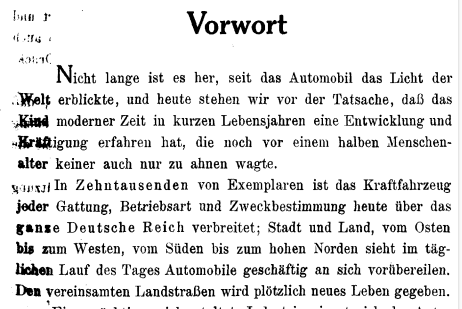

<!--
author:   Sebastian Zug

email:    sebastian.zug@informatik.tu-freiberg.de

version:  0.0.1

language: en

comment:  Arbeit mit Jupyter Notebooks

narrator: DE

-->

# TUBAF Bits&Bytes

Praktische Datenaggregation und -analysen mit Python am Beispiel der Freiberger Einträge im "Deutschen Autombiladressbuch" von 1909 
----------------------------------------------------------------

Donnerstag, 14.11.2024, 17 Uhr, RoboLab der TU Bergakademie Freiberg

---------------------

Prof. Dr. Sebastian Zug

> _Am Beispiel eines Verzeichnisses von Fahrzeughaltern und -halterinnen (die es tatsächlich vor 100 Jahre gab) zeigt der Vortrag wie eine konkrete Datenexploration vorbereitet und umgesetzt wird. Der Bits&Bytes Vortrag mit Prof. Sebastian Zug führt dazu als Grundlage verschiedene Pythonpakete zur Erfassung, Strukturierung und Visualisierung des Datenbestandes ein und erläutert konkrete Fallstricke bei deren Nutzung besprochen. Neben Studierenden aller Fachrichtungen der Bergakademie freut sich das RoboLab-Team auch über Teilnehmende mit einem regionalhistorischen Interesse._

## Agenda

+ Was sind Jupyter Notebooks und worin unterscheiden sie sich von konventionellen Python-Programmen?
+ Wie baue ich ein Datenanalyseprojekt auf?
+ Welche Herausforderungen bestehen ganz praktisch bei der Datenanalyse?

## Ausgangspunkt

Das "Deutsche Automobiladressbuch" wurde durch den Verein für Computergeneralogie digitalisiert und ist unter folgendem Link verfügbar: [Deutsches Automobiladressbuch 1909](https://wiki.genealogy.net/Deutsches_Automobil-Adre%C3%9Fbuch/Adressbuch_1909)

https://wiki.genealogy.net/Deutsches_Automobil-Adre%C3%9Fbuch/Adressbuch_1909

Das Ganze ist mit einer Suchmaske verknüpft, so dass interessiererte Personen nach bestimmten Namen oder Orten suchen können.

https://des.genealogy.net/autos1909/search?lastname=&firstname=&value01=&value02=&value03=&value04=Freiberg&value05=&value06=&value07=&value08=&pageName=&search=Search&page=0

> Warum sollten wir uns den Datensatz als Ganzes anschauen und trotz der Suchmaske den Datensatz individuell analysieren?

+ Die Suchmaske ermöglicht individuelle Abfragen, aber keine systematische Analyse des Gesamtdatensatzes.
+ Der Datensatz enthält [Fehler](https://wiki.genealogy.net/Deutsches_Automobil-Adre%C3%9Fbuch/Adressbuch_1909/Editionsrichtlinien) (`Wilhelm ll.` statt `Wilhelm II.`), die bei einer individuellen Suche nicht auffallen.
+ Mit unserer Analyse können wir indivduelle Visualisierungen erstellen, die die Suchmaske nicht anbietet.

> Forschungsfrage: War Freiberg ein Vorreiter der Automobilisierung in Deutschland? In welchem Verhältnis steht die Zahl der Kraftfahrzeuge zu den Einwohnern? 
> Ziel ist eine Karte der Daten mit einer Angabe der Verhältnisse von Einwohnern zu Automobilbesitzern.

## Vorbereitung

Der Gesamtdatensatz kann als CSV-Datei heruntergeladen werden - https://codingdavinci.de/de/daten/autobesitzer-1909.

> Wie sieht der Datensatz aus?
 	
| Last name     | First name | Kennzeichen | Nummer | Beruf/Stand | Wohnort  | Adresse | Art des Fahrzeugs | Kreis / Stadt                | Firma | Page |
| ------------- | ---------- | ----------- | ------ | ----------- | -------- | ------- | ----------------- | ---------------------------- | ----- | ---- |
| Bartsch       | Emil       | II          | 1955   | Kaufmann    | Freiberg |         | KrR.              | Kreishauptmannschaft Dresden |       | 150  |
| Bretschneider | Felix      | II          | 1312   | Kaufmann    | Freiberg |         |                   | Kreishauptmannschaft Dresden |       | 134  |
| Böhme         | Emil       | II          | 1830   | Sergeant    | Freiberg |         | KrR.              | Kreishauptmannschaft Dresden |       | 147  |
| Damies        | Max        | II          | 2309   | Kaufmann    | Freiberg |         | KrR.              | Kreishauptmannschaft Dresden |       | 160  |
| ...           |            |             |        |             |          |         |                   |                              |       |      |
|               |            |             |        |             |          |         |                   |                              |       |      |

> Welche Probleme erwarten uns?

+ Formale Probleme: 
    + Die Spalten sind nicht eindeutig benannt.
    + Die Spalten enthalten leere Einträge (offenbar unterschieden sich die von den Behörden aufgezeichneten Informationen).
    + Die Spalten enthalten Fehler bei der Erfassung vor 100 Jahren oder bei der Digitalisierung.

+ Inhaltliche Probleme:
    + Uns fehlen notwendige Informationen zur Beantwortung der Forschungsfragen (Einwohner Freibergs, Räumliche Lage)
    + Ortsnamen sind nicht eindeutig (`Cöln` vs `Köln`)
    + ...

> Wie gehen wir vor?

Excel ist für uns aus vielen Gründen keine gute Wahl. Wir verwenden Jupyter Notebooks, um die Daten zu analysieren und zu visualisieren.

## Notebooks 

Jupyter Notebooks sind eine interaktive Umgebung, die es ermöglicht, Code, Text und Visualisierungen in einem Dokument zu kombinieren.

> Warum verwenden wir Jupyter Notebooks?

+ Wir können Code und Text kombinieren.
+ Wir können Code-Zellen einzeln ausführen und so Schritt
+ Wir können Visualisierungen direkt im Notebook anzeigen.
+ Wir können Notebooks leicht teilen und in anderen Umgebungen verwenden.

> Wie kann die Nutzung in der Praxis aussehen?

+ als Webservice (z.B. [Google Colab](https://colab.research.google.com/))
+ im Browser mit einem Server im Hintergrund ([JupyterLab](https://jupyterlab.readthedocs.io/en/stable/))
+ in einer IDE (z.B. [Visual Studio Code](https://code.visualstudio.com/))

> Keine Sorge wegen fehlender Python Kenntnisse - diverse Large Language Models wie ChatGPT werden uns helfen.

