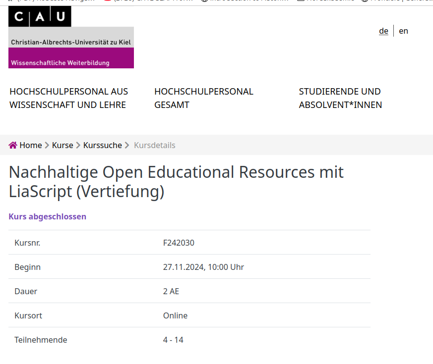

<!--
author:   Sebastian Zug; André Dietrich

email:    sebastian.zug@informatik.tu-freiberg.de

version:  0.1.1

language: de

narrator: Deutsch Female

icon:     https://media.aubi-plus.com/institution/thumbnail/3f3de48-technische-universitaet-bergakademie-freiberg-logo.jpg

link:     style.css

import:   https://raw.githubusercontent.com/liaTemplates/TextAnalysis/main/README.md
          https://raw.githubusercontent.com/LiaScript/CodeRunner/master/README.md
          https://raw.githubusercontent.com/LiaTemplates/LiveEdit-Embeddings/refs/tags/0.0.1/README.md

@runManimAnimation
```text   -manim.cfg
[CLI]
background_color = BLACK
media_dir = .
video_dir = .
images_dir = .
#verbosity = ERROR
#quiet = True
#progress_bar = none 
```
@LIA.eval(`["main.py","manim.cfg"]`, `none`, `manim render --format=webm main.py MyScene -o animation`)
@end

-->

[](https://liascript.github.io/course/?https://raw.githubusercontent.com/SebastianZug/RoboLabVortraege/main/45_LiaScript/presentation.md#1)

# TUBAF Bits&Bytes

Interaktive Lehr-Lern-Materialien mit LiaScript - Neue Features & Erfahrungen
----------------------------------------------------------------

Donnerstag, 06.02.2025, 17 Uhr, RoboLab der TU Bergakademie Freiberg

---------------------


Prof. Dr. Sebastian Zug

> _Lernwirksam zu unterrichten und Vorlesungen damit zu bleibenden Erinnerungen zu machen, kann dann möglich sein, wenn Studierende und Vorlesende interagieren. An der TUBAF wurde dafür mit LiaScript eine Beschreibungssprache für Lehr-Lern-Inhalte entwickelt, die sich dadurch auch als Open Educational Resources (OER) gemeinsam nutzen und weiterentwickeln lassen._

# Warum braucht OER eine gemeinsame Sprache?!

> Lassen Sie uns mit einer Umfrage beginnen!

---------------------

> Umfrage: In welchen Format haben Sie bereits OER öffentlich zur Verfügung gestellt?

- [(pdf)] pdf
- [(office)] Office Format (word, powerpoint, ...)
- [(opal)] Opal
- [(liascript)] LiaScript
- [(others)] andere Formate

----------------------


## Motivation

                  {{0-1}}
******************************************

> Wer von Ihnen kennt die Videos von `3brown1blue`? 

!?[3blue1brown](https://www.youtube.com/watch?v=r6sGWTCMz2k&t=719s "Video aus der Reihe zu Differentialgleichungen mit 17 Millionen Views")

******************************************

                  {{1-2}}
******************************************

> Was macht dieses Videos so erfolgreich?

- gut designte Animationen
- eigene Lerngeschwindigkeit (Stop, Pause, Rückspulen)
- weiterführende Materialien als Links


Warum können aber nicht alle relevanten Veranstaltungen 

+ das Video zeigen und haben damit die Materialvorbereitung abgeschlossen oder  
+ eigene Animationen in diesem Stil umsetzen?

******************************************

                  {{2-3}}
******************************************

| Limitierung                                         | Erläuterungen                                                                                                                                               |
| --------------------------------------------------- | ----------------------------------------------------------------------------------------------------------------------------------------------------------- |
| _Fehlende Anpassungsfähigkeit_                      | Das finale Material - ein Video - ist statisch und kann nur mit erheblichen Aufwand auf individuelle didaktische Ziele oder Vorkenntnisse angepasst werden. |
| _Einstiegshürde Vorwissen/Fähigkeiten_              | Die Umsetzung der Animationen, Gleichungen usw. erfordert spezielle Kenntnisse / Technikaffinität.                                                          |
| _Interaktivität ist konzeptionell nicht vorgesehen_ | Ein Eingriff des Nutzenden ist nicht vorgesehen.                                                                                                            |
| _Abhängigkeit von einer Plattform_                  | Die Videos sind nur bei bestehender Internetverbindung verfügbar.                                                                                           |

> Offenbar gibt es eine Lücke zwischen dem, was technisch möglich ist und dem, was in der Lehre umgesetzt wird. Zudem ist die Wiederverwendbarkeit durch "Formatinseln" eingeschränkt.

******************************************

## Lösungsansatz

> __Wir trennen Darstellung und Inhalt! Alle Elemente werden soweit wie möglich durch eine rein textuelle Repräsentation ausgedrückt.__

                  {{1-2}}
******************************************

> Das ist kein neuer Ansatz ...

_Im modernen Webdesign kommt den Webtechniken HTML, CSS und JavaScript jeweils eine bestimmte Rolle zu._

+ _HTML legt fest, was auf der Seite stehen soll (struktureller Aufbau einer Webseite)_
+ _CSS legt fest, wie es dargestellt werden soll (Formatierung & Gestaltung)_
+ _JavaScript legt fest, was passieren soll. (interaktive Elemente)_

https://wiki.selfhtml.org/wiki/HTML/Tutorials/Trennung_von_Inhalt,_Pr%C3%A4sentation_und_Verhalten

> ... aber wir übertragen das Konzept auf die Erstellung von Lehr-Lern-Materialien.

******************************************

### Konzept

Was ist damit gemeint?

```markdown @embed.style(height: 550px; min-width: 100%; border: 1px black solid)
# Vom Text zur Darstellung

__Mathematik__

$f(x) = x^2$

__Tabellen__

| X | B(y) | C(y) |
|---|:----:|:----:|
| 1 |   2  |   3  |
| 4 |   5  |   6  |

__Sprache__

> Click to run!
>
> {{|> Deutsch Female}}
> Markdown ist eine vereinfachte Auszeichnungssprache, die der Ausgangspunkt unserer Entwicklung von LiaScript war.
```

### Konsequenzen und Chancen

<details>

<summary>__Fehlende Anpassungsfähigkeit__ -> Generelle Editierbarkeit </summary>

Die textuellen Repräsenation eröffnet die Möglichkeit, dass

+ jeder Nutzende Materialien anpassen kann und
+ eine Versionierung der Materialien mit etablierten Tools realisiert werden.

!?[Einbettung Studierender bei der Bearbeitung von Materialien](https://github.com/TUBAF-IfI-LiaScript/.github/assets/10922356/00a24602-dc63-4b9a-894b-80967b914513)

</details>

<details>

<summary>__Einstiegshürde Vorwissen/Fähigkeiten__ -> Generierung von Inhalten </summary>

Die textuelle Repräsentation erlaubt den extensiven Einsatz von KIs für die Textgenerierung.

``` text
Generiere mir eine Animation, die die Multiplikation von
zwei Matrizen mit manim im Stil von 3blue1brown zeigt.
```

```python -manim.py
from manim import *

class MyScene(Scene):
    def construct(self):
        # Define the matrices
        matrix_A = MathTex(r"\begin{bmatrix} 1 & 2 \\ 3 & 4 \end{bmatrix}", color=BLUE)
        matrix_B = MathTex(r"\begin{bmatrix} 5 & 6 \\ 7 & 8 \end{bmatrix}", color=GREEN)
        matrix_C = MathTex(r"\begin{bmatrix} 19 & 22 \\ 43 & 50 \end{bmatrix}", color=YELLOW)

        # Position the matrices on the screen
        matrix_A.move_to(LEFT * 3)
        matrix_B.move_to(ORIGIN)
        equals_sign = MathTex("=").next_to(matrix_B, RIGHT)
        matrix_C.next_to(equals_sign, RIGHT)

        # Display matrices and equals sign
        self.play(Write(matrix_A), Write(matrix_B))
        self.play(Write(equals_sign), Write(matrix_C))

        # Highlight the first row and first column
        row_rect = SurroundingRectangle(matrix_A[0][2:4], color=BLUE, buff=0.1)
        col_rect = SurroundingRectangle(matrix_B[0][0:2], color=GREEN, buff=0.1)
        self.play(Create(row_rect), Create(col_rect))

        # Compute the first element of the result (19)
        dot_prod_1 = MathTex("1 \\cdot 5 + 2 \\cdot 7 = 19")
        dot_prod_1.next_to(matrix_A, UP)
        self.play(Write(dot_prod_1))
        self.play(Transform(dot_prod_1, matrix_C[0][2:4].copy()))
        self.play(FadeOut(dot_prod_1))

        # Final pause to view the result
        self.wait(2)
```
@runManimAnimation

</details>

<details>

<summary> __Fehlende Interaktivität__ -> Sprachfeatures und Plugins </summary>

Die Sprachkonzepte von LiaScript und die Einbettung von Plugins ermöglichen die Integration von interaktiven Elementen.

```markdown @embed.style(height: 550px; min-width: 100%; border: 1px black solid)
# Quiz

Wann wurde die TU Freiberg gegründet?

- [(X)] 1765
- [( )] 1865
- [( )] 1965
****

Am 21. November 1765 wurde die Bergakademie Freiberg gegründet. Ihre Etablierung ist als eine Maßnahme der sächsischen Regierung zu betrachten, die Wirtschaft nach dem „Augusteischen Zeitalter“ und dem Siebenjährigen Krieg (1756-63) durch verstärkte Nutzung heimischer Rohstoffe zu initiieren. [Link](https://tu-freiberg.de/universitaet/profil/geschichte)

****
```


````markdown @embed.style(height: 550px; min-width: 100%; border: 1px black solid)

<!--
import: https://github.com/liascript/CodeRunner
-->

# Programmierübungen

Debuggen Sie den nachfolgenden Code

```cpp                     ErroneousHelloWorld.cpp
#include <iostream>

imt main() {
	std::cout << "Hello World!'';
	std::cout << "Wo liegt der Fehler?";
	return 0;
}
```
\@LIA.evalWithDebug(`["main.cpp"]`, `g++ main.cpp -o a.out`, `./a.out`)
````

</details>

<details>

<summary>__Abhängigkeit von einer Plattform__ -> Exportierbarkeit </summary>

Durch die Trennung von Inhalt und Ausführung können die Kurse in LMS, Progressive Web Apps oder als PDF exportiert werden.

!?[LiaScript auf Nokia-Basis](https://www.youtube.com/watch?v=U_UW69w0uHE)

</details>

## Warum funktioniert das bisher nicht?

             {{0-1}}
******************************************

> Wir nutzen die falschen Werkzeuge!

<!-- data-type="none"-->
| OPAL OER Materialien | Anzahl | Limitierung                              |
| -------------------- | -----: | ---------------------------------------- |
| Kurse                |   3828 | + nur über "Umwege" exportierbar         |
|                      |        | + Infrastruktur für Ausführung notwendig |
| einzelne Dateien     |  11322 | + überwiegend unveränderliche Inhalte    |
|                      |        | + fehlende Metadaten                     |

<!-- data-type="barchart" data-show="true" data-xlabel="Dateitypen"
     data-ylabel="Anteil in Prozent" data-title="Dominierend Dateitypen im OPAL OER Datenbestand" -->
| Format | Anteil [%]  |
| ------ | ---------: |
| pdf    |       53.0 |
| jpg    |       10.5 |
| mkv    |        8.8 |
| mp4    |        5.9 |
| png    |        5.0 |
| zip    |        4.4 | 
| html   |        3.9 |
| docx   |        3.8 |
| pptx   |        2.4 |
| xlsx   |        1.9 |

> Untersuchungen des Projektes "OER-Connected Lectures", dass durch den AK Elearning Sachsen 2024/25 gefördert wird (https://github.com/TUBAF-IFI-ConnectedLecturer)

******************************************

             {{1-2}}
******************************************

> Wir brauchen aber auch Überwindung auf Seiten der Lehrenden und der Studierenden!

 (Uni Leipzig) zum kooperativen Editieren von pdf-Dateien")

******************************************

## Ausblick und Vision

             {{0-1}}
******************************************

1. Wir brauchen eine Loslösung von Frameworks und Plattformen und einen Fokus auf die Inhalte als Gelingensbedingung für OER.

2. AI wird die Diskussionen im Bereich von OER dahingehend verändern, dass die Generierung von Inhalten und die Anpassung an individuelle Bedürfnisse im Vordergrund stehen.

3. Die Abbildung der Inhalte als Text eröffnet in viel größerem Maße die Möglichkeit zu kollaborativer Erstellung und Anpassung.

--------------------

> ... Ach so, das Ganze ist keine "Spielwiese für Nerds", sondern wird an einer Vielzahl von  Universitäten in der Lehre und Forschung eingesetzt.




--------------------------------

> Dieser Vortrag ist eine Open Educational Resource (OER) und steht unter der Lizenz [CC BY 4.0](https://creativecommons.org/licenses/by/4.0/deed.de).
>
> Alle enthaltenen Inhalte können frei verwendet werden und sind unter https://github.com/Cross-Lab-Project/presentations/blob/main/45_LiaScript/presentation.md verfügbar.

******************************************

             {{1-2}}
******************************************

> __Lust auf eine Live Demo?__

Natürlich mit KI Unterstützung ...

```markdown
Erzeuge mir einen LiaScript-Kurs zur Bergakademie Freiberg, der
+ eine kurze Beschreibung mit entsprechenden Links, 
+ eine Tabelle mit der Entwicklung der Studierendenzahlen, 
+ eine Auflistung der Fakultäten,
+ eine mathematische Gleichung, zur Illustration der Latexintegation, die 1765 als Ergebnis hat und 
+ ein Quiz zur Geschichte umfasst.
```

```markdown  Freiberg.md
# Bergakademie Freiberg

## Einführung

Die Technische Universität Bergakademie Freiberg ...
```

> __Los gehts ...__

******************************************