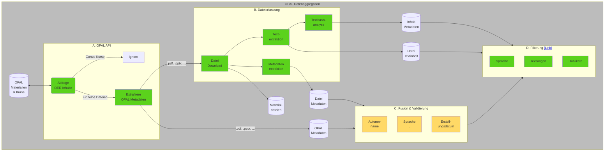
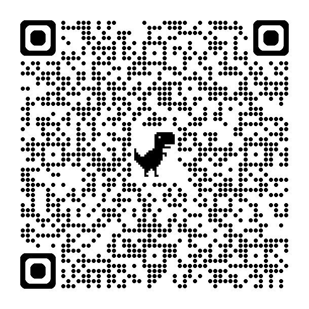

<!--
author:   Sebastian Zug; André Dietrich

email:    sebastian.zug@informatik.tu-freiberg.de

version:  0.1.1

language: de

narrator: Deutsch Female

icon:     https://media.aubi-plus.com/institution/thumbnail/3f3de48-technische-universitaet-bergakademie-freiberg-logo.jpg

link:     style.css

import:   https://raw.githubusercontent.com/liaTemplates/TextAnalysis/main/README.md
          https://raw.githubusercontent.com/LiaScript/CodeRunner/master/README.md
          https://raw.githubusercontent.com/LiaTemplates/LiveEdit-Embeddings/refs/tags/0.0.1/README.md
          https://raw.githubusercontent.com/liaTemplates/AVR8js/main/README.md
          https://raw.githubusercontent.com/liascript-templates/plantUML/master/README.md
          https://raw.githubusercontent.com/liaScript/mermaid_template/master/README.md


mark
  <span style="background-color: @0;
                           display: flex;
                           width: calc(100% + 32px);
                           margin: -16px;
                           padding: 6px 16px 6px 16px;
                           ">@1</span>
@end                           

red:  @mark(#FF888888,@0)


-->

[](https://liascript.github.io/course/?https://raw.githubusercontent.com/SebastianZug/RoboLabVortraege/main/45_LiaScript/presentation.md#1)

# TUBAF Bits&Bytes

OER-Connected Lectures (OER-CL)
----------------------------------------------------------------

Donnerstag, 27.02.2025, 17 Uhr, RoboLab der TU Bergakademie Freiberg

---------------------


Prof. Dr. Sebastian Zug, André Dietrich (Fakultät 1), Oliver Löwe (Universitätsbibliothek der TUBAF)

> _OER in OPAL? In OPAL existiert eine große Sammlung von mit einer offenen Lizenz markierten Lehr-Lern-Inhalten, die über das Suchportal der Bibliothek auch außerhalb des Lernmanagementsystems verfügbar sind. Allerdings fehlen für viele der Materialien die zugehörigen Metainformationen, so dass diese inhaltlich nicht durchsuchbar sind. Der eigentliche Gedanke von OER und der möglichst breiten Verwendung kommt damit zu kurz._ 
>
> _Der Vortrag beschreibt das Vorhaben OER-CL, in dem die automatisierte Inhaltserschließung und ein Vorschlagssystem untersucht wird, das Lehrende aus Sachsen auf ähnliche Materialien von anderen Autorinnen und Autoren verweist._


<!-- class="reference"-->
> Das Vorhaben wird mit einer Laufzeit 2024-2025 durch den [AK Elearning Sachsen](https://bildungsportal.sachsen.de/portal/parentpage/institutionen/arbeitskreis-e-learning-der-lrk-sachsen/) gefördert. 


## Motivation

                   {{0-1}}
*************************************************

__Warum überhaupt OER?__

> _Open Educational Resources (OER) sind Bildungsmaterialien jeglicher Art und in jedem Medium, die unter einer offenen Lizenz stehen. Eine solche Lizenz ermöglicht den kostenlosen Zugang sowie die kostenlose Nutzung, Bearbeitung und Weiterverbreitung durch Dritte ohne oder mit geringfügigen Einschränkungen._ (Quelle: [UNESCO](https://www.unesco.de/bildung/open-educational-resources))

*************************************************

                   {{1-3}}
*************************************************

__Bitte etwas konkreter!__

<div id="example">
<wokwi-led color="red"   pin="13" label="13"></wokwi-led>
<wokwi-led color="green" pin="12" label="12"></wokwi-led>
<wokwi-led color="blue"  pin="11" label="11"></wokwi-led>
<wokwi-led color="blue"  pin="10" label="10"></wokwi-led>
<span id="simulation-time"></span>
</div>

``` cpp Blink.cpp
byte leds[] = {13, 12, 11, 10};

void setup() {
  for (byte i = 0; i < sizeof(leds); i++) {
    pinMode(leds[i], OUTPUT);
  }
}

int i = 0;
void loop() {
  digitalWrite(leds[i], HIGH);
  delay(250);
  digitalWrite(leds[i], LOW);
  i = (i + 1) % sizeof(leds);
}
```
@AVR8js.sketch(example)

*************************************************

                   {{2-3}}
*************************************************

> OER unterstützen den individuellen Lehrenden bei der Erstellung von interaktiven Lehr-Lern-Inhalten, die die Kapazitäten eines einzelnen übersteigen.

*************************************************

## Ausgangspunkt OER


_Ich veröffentliche meine Lehrmaterialien und freue mich darüber, wenn andere Dozierende/Lernende diese nutzen._

    [(immer )] immer
    [(bisweilen )] bisweilen
    [(gar nicht )] gar nicht

_Ich nutze Materialien anderer Dozierender._

    [(häufig )] immer
    [(bisweilen )] bisweilen
    [(gar nicht )] gar nicht

_Ich habe bereits Inhalte in OPAL mit einer offenen Lizenz hochgeladen._

    [(ja )] ja
    [(nein )] nein

### Herausforderungen bei der Integration von OER

Welche Hemnisse sehen Lehrende bei der Verwendung von OER-Inhalten in Ihrer Lehre?

1. _Rechtliche Unsicherheiten_
2. _Technische Hürden_
3. _Fehlende Passgenauigkeit_
4. _Eigene Qualitätsstandards_
5. ___Aufwändige Suche nach passenden Materialien___
6. ...

<!-- class="reference"-->
> "_Vorstudie zur OER-Initiative sächsischer Hochschulen_" (2023-2024) [Link](https://www.hd-sachsen.de/projekte/oer-initiative-02/2023-07/2024)

<!-- class="reference"-->
> "_Offene Bildungsinfrastrukturen - Anforderungen an eine OER-förderliche IT-Infrastruktur_" (2023), HIS-Institut für Hochschulentwicklung e. V, [Link](https://medien.his-he.de/publikationen/detail/offene-bildungsinfrastrukturen)

<!-- class="reference"-->
> "_Didaktische Metadaten in OER- und Lehrportalen Von der Prämisse pädagogischer Neutralität zur Stärkung einer offenen Lehrpraxis_" (2024), HIS-Institut für Hochschulentwicklung e. V, [Link](https://medien.his-he.de/fileadmin/user_upload/Publikationen/Forum_Hochschulentwicklung/HIS-HE-Forum_Didaktische_Metadaten_in_OER-_und_Lehrportalen.pdf)

### Besondere Motivation mit Blick auf OPAL

{{0-1}}
**************************************

<!-- class="reference"-->
> "_Anreicherung digitaler Objekte mit Metadaten in OPAL – Implementierung einer Schnittstelle zur Anbindung externer Recherchesysteme_", 2017/2018, [Link](https://bildungsportal.sachsen.de/impulse/projekt/anreicherung-digitaler-objekte-mit-metadaten-in-opal-implementierung-einer-schnittstelle-zur-anbindung-externer-recherchesysteme/)

Das Projekt der UB zielte 2018 darauf ab die Integration von OER in OPAL zu erleichtern. Entsprechend finden sich die OER-Inhalte als Suchgegenstand in der gewohnten Recherche-Umgebung.

```text @plantUML.png
@startuml
skinparam style strictuml
alt Ist-Zustand
OERAutor_A as "OER\nAutorin" -> OPAL as "OPAL \n ": neues Dokument ohne Metadaten
Lernender_A as "Eingeschriebener\nLenender"--> OPAL : <font color=gray>Zugriff aus dem \n<font color=gray>OPAL Kurs
OPAL --> Lernender_A : <font color=gray>Dokument
OPAL -[#green]> UB_Katalog as "UB \nKatalog": Spiegelung
OERAutor_B as "OER Autor\nLernender" -[#green]> UB_Katalog !!: Suche nach Lern-\nLern-material XY
end

@enduml
```

Eigne Recherchen im OPAL-Katalog sind unter [Link](https://katalog.ub.tu-freiberg.de/Search/Results?lookfor=source_id%3A172+AND+author%3AZitzelsberger&type=AllFields&hiddenFilters%5B%5D=institution%3ADE-105&limit=20) möglich.

**************************************


{{1-2}}
**************************************

<iframe src="https://katalog.ub.tu-freiberg.de/Search/Results?lookfor=source_id%3A172+AND+author%3AL%C3%B6we&type=AllFields&hiddenFilters%5B%5D=institution%3ADE-105&limit=20" title=""></iframe><!--style="width:100%; display:block; height: 70vh;"--> 


**************************************


{{2-3}}
**************************************

> Es fehlen die Metadaten für die gezielte Exploration der OER-Inhalte im OPAL!

<!-- data-type="none" -->
| Attribut                | Anzahl leerer Einträge | Anteil in Prozent |
| ----------------------- | ---------------------: | ----------------: |
| `opal:filename`         |                      0 |               0.0 |
| `opal:oer_permalink`    |                      0 |               0.0 |
| `opal:license`          |                      0 |               0.0 |
| `opal:author`           |                  14006 |              97.6 |
| `opal:title`            |                  13962 |              97.3 |
| `opal:comment`          |                  14132 |              98.4 |
| `opal:language`         |                  14312 |              99.7 |
| `opal:publicationMonth` |                  14105 |              98.2 |
| `opal:publicationYear`  |                  14105 |              98.2 |
| `opal:revisedAuthor`    |                  14032 |              97.7 |

**************************************


### Ursachenforschung

")

## Projektziele OER-CL

```text @plantUML.png
@startuml
skinparam style strictuml
alt Projektvision
OERAutor_A -> OPAL : neues Dokument
activate OPAL
OPAL -> OPAL: KI basierte Extraktion
OPAL ->  OERAutor_A: Vorschläge zu den Metadaten
deactivate OPAL
OERAutor_A -> OPAL : ggf. korrigierte Metadaten

OPAL -> UB_Katalog : Spiegelung angereicherter Metadaten
OERAutor_B -> UB_Katalog : Erweiterte Suche
UB_Katalog -> OERAutor_B : 

OPAL -> OERAutor_A : Hinweis auf alternative Materialien\nanderer Autoren

end

@enduml
```

----

Kurzversion der Projektziele:

```ascii
+------------------------------------------------------------+
|    Extraktion von Metadaten                                |        
|    Evaluation mit Autoren                                  |        
|  + Vorschlagssystem                                        |
| ---------------------------                                |
|  = Connected Lecturers                                     |    
+------------------------------------------------------------+                                                              .
```


> In diesem Projekt fokussieren wir uns auf die Einzeldateien, die in OPAL hochgeladen werden. Ganze Kurse bleiben außen vor.

## Status der Umsetzung

<!--
data-type="barchart"
data-title="Datentypen im OPAL-OER Datensatz"
data-show
-->
| Dateityp | Anzahl |
| -------- | -----: |
| `.pdf`   |   6962 |
| `.jpg`   |   1237 |
| `.mkv`   |    869 |
| `.mp4`   |    602 |
| `.png`   |    563 |
| `.zip`   |    466 |
| `.docx`  |    441 |
| `.html`  |    430 |
| `.pptx`  |    224 |
| `.xlsx`  |    208 |
| `.m`     |    182 |
| `.py`    |    171 |
| `.ipynb` |    145 |
| `.mp3`   |    102 |
| `.epub`  |     88 |


> Insgesamt reden wir über 14.015 Dateien! 55% davon gehören zu den Office Datei-Typen (`.pptx`, `.docx`, ...) und `.pdf` Dateien (Stand August 2024).

> Interessanterweise konnten einige Dokumente nicht heruntergeladen bzw. nicht geöffnet werden. Hier waren einige OER schlicht und ergreifend mit einem Passwort geschützt :-)

### Schritt 1: Aggregation der Daten





### Schritt 2: AI basierte Merkmalsextraktion

Ausgehend von einer Abbildung der Inhalte der Materialdateien anhand ihrer Embeddings wurde eine Vectordatenbank aufgebaut. Anhand dieser werden die 

+ __Extraktion von Metadaten__ (z.B. Autor, Titel, Schlüsselworte ...) und
+ __Klassifikation__ (z.B. Bibliografische Einordnung, ...) sowie 
+ __Ableitung von Ähnlichkeitswerten__

vorgenommen.

```python 
author = get_monitored_response(f"""
    Wer ist der Autor oder die Autoren der Datei {file}. Vermeide alle zusätzlichen Informationen 
    und antworte  einfach mit dem Namen des Autors. Füge  nicht etwas wie `Der 
    Autor des Dokuments ist` hinzu. Bitte antworte  auf Deutsch.""", chain)
metadata_list_sample['ai:author'] = filtered(author)
```

Die Umsetzung der gesamten Pipeline ist unter url als Open Source verfügbar: [Data_aggregation](https://github.com/TUBAF-IFI-ConnectedLecturer/Data_aggregation) verfügbar. Die gesamte Pipeline ist in Python implementiert und nutzt für die AI Komponenten eine Nvidia DGX2. Als LLM kommt aktuell ein [gemma2](https://ollama.com/library/gemma2) zum Einsatz.

Der Abgleich der Schlagworte und der Dewey-Klassifikation mit der [Normdatei](https://lobid.org/gnd) steht noch aus.

## Ergebnisse

                     {{0-1}}
****************************************************

<!-- data-type="none" -->
|  Attribut                  | 495                                                                                                                                     |
| :----------------------- | :-------------------------------------------------------------------------------------------------------------------------------------- |
| `pipe:ID`                | 1PGOlNUd1m7g                                                                                                                            |
| `pipe:file_type`         | pptx                                                                                                                                    |
| `opal:filename`          | cdvost_praesi.pptx                                                                                                                      |
| `opal:oer_permalink`     | https://bildungsportal.sachsen.de/opal/oer/1PGOlNUd1m7g                                                                                 |
| `opal:license`           | CC BY-NC 4.0 Int.                                                                                                                       |
| `opal:creator`           | @red(Oliver Löwe)                                                                                                                       |
| `opal:title`             | Anlagen bergbaulicher Zeichnungen beim Kultur-Hackathon Coding Da Vinci                                                                 |
| `opal:comment`           | Coding Da Vinci Ost von der Universitätsbibliothek Leipzig ausgetragen; 14./15.4.2018; UB Freiberg ist Datengeber der Leupoldsammlungen |
| `opal:language`          | Deutsch                                                                                                                                 |
| `opal:publicationMonth`  | 4                                                                                                                                       |
| `opal:publicationYear`   | 2018                                                                                                                                    |
| `file:author`            | @red(Löwe Oliver)                                                                                                                       |
| `file:keywords`          |                                                                                                                                         |
| `file:subject`           |                                                                                                                                         |
| `file:title`             | Zeichnungen bergbaulicher Anlagen (Leupoldsammlung)                                                                                     |
| `file:created`           | 2018-04-04 10:39:43+00:00                                                                                                               |
| `file:modified`          | 2018-04-14 11:24:44+00:00                                                                                                               |
| `file:language`          |                                                                                                                                         |
| `ai:author`              | @red(Oliver Löwe)                                                                                                                       |
| `ai:affilation`          | TU Bergakademie Freiberg, Universitätsbibliothek                                                                                        |
| `ai:title`               | Es gibt keine Datei mit dem Titel "1PGOlNUd1m7g.pptx" im vorgegebenen Kontext.                                                          |
| `ai:keywords`            | TU Bergakademie Freiberg, Universitätsbibliothek, Leupoldsammlung, Zeichnungen, Montanwesen                                             |
| `ai:keywords2`           | TU Bergakademie Freiberg, Universitätsbibliothek, Leupoldsammlung, Zeichnungen, Bergbau                                                 |
| `ai:dewey`               | 622.8                                                                                                                                   |

****************************************************

                       {{1-2}}
****************************************************

<!-- data-type="none" -->
|                          | 495                                                                                                                                     |
| :----------------------- | :-------------------------------------------------------------------------------------------------------------------------------------- |
| `pipe:ID`                | 1PGOlNUd1m7g                                                                                                                            |
| `pipe:file_type`         | pptx                                                                                                                                    |
| `opal:filename`          | cdvost_praesi.pptx                                                                                                                      |
| `opal:oer_permalink`     | https://bildungsportal.sachsen.de/opal/oer/1PGOlNUd1m7g                                                                                 |
| `opal:license`           | CC BY-NC 4.0 Int.                                                                                                                       |
| `opal:creator`           | Oliver Löwe                                                                                                                             |
| `opal:title`             | Anlagen bergbaulicher Zeichnungen beim Kultur-Hackathon Coding Da Vinci                                                                 |
| `opal:comment`           | Coding Da Vinci Ost von der Universitätsbibliothek Leipzig ausgetragen; 14./15.4.2018; UB Freiberg ist Datengeber der Leupoldsammlungen |
| `opal:language`          | Deutsch                                                                                                                                 |
| `opal:publicationMonth`  | 4                                                                                                                                       |
| `opal:publicationYear`   | 2018                                                                                                                                    |
| `file:author`            | Löwe Oliver                                                                                                                             |
| `file:keywords`          |                                                                                                                                         |
| `file:subject`           |                                                                                                                                         |
| `file:title`             | Zeichnungen bergbaulicher Anlagen (Leupoldsammlung)                                                                                     |
| `file:created`           | 2018-04-04 10:39:43+00:00                                                                                                               |
| `file:modified`          | 2018-04-14 11:24:44+00:00                                                                                                               |
| `file:language`          |                                                                                                                                         |
| `ai:author`              | Oliver Löwe                                                                                                                             |
| `ai:affilation`          | TU Bergakademie Freiberg, Universitätsbibliothek                                                                                        |
| `ai:title`               | Es gibt keine Datei mit dem Titel "1PGOlNUd1m7g.pptx" im vorgegebenen Kontext.                                                          |
| `ai:keywords`            | <!--style="background-color:#FF888888"--> TU Bergakademie Freiberg, Universitätsbibliothek, Leupoldsammlung, Zeichnungen, Montanwesen   |
| `ai:keywords2`           | <!--style="background-color:#FF888888"--> TU Bergakademie Freiberg, Universitätsbibliothek, Leupoldsammlung, Zeichnungen, Bergbau       |
| `ai:dewey`               | <!--style="background-color:#FF888888"--> 622.8                                                                                         |

> Die DDC Klassifikation 622 trägt das Label "Bergbau und verwandte Tätigkeiten" vgl. [GND](https://lobid.org/gnd/4005614-4)

****************************************************

### Suchmechanismen

Demo im Notebook

### Ausblick 

> Tabellen sind doch langweilig! Wir arbeiten an einer Visualisierung der Metadaten, die eine schnelle Übersicht über die Inhalte ermöglicht. 

__Variante 1: Dewey-Klassifikationsgetrieben__


__Variante 2: Embedding-getrieben__

Link

## Danke 

<div class="left">

> Vielen Dank für Ihr Interesse! Wir freuen uns auf Ihre Fragen und Anregungen.

Sebastian Zug

<a href="mailto:sebastian.zug@informatik.tu-freiberg.de">
    sebastian.zug@informatik.tu-freiberg.de 
</a>

------------------

Oliver Löwe

<a href="mailto:oliver.loewe@ub.tu-freiberg.de">
    oliver.loewe@ub.tu-freiberg.de
</a>

</div>

<div class="right">



</div>


